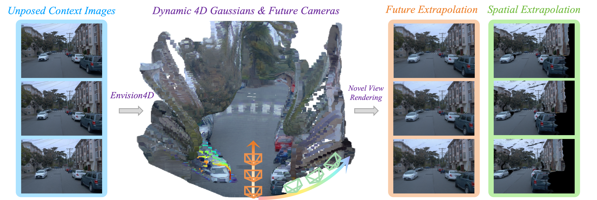

<div align="center">

# Envision4D: Envisioning Visual Futures via Feed-forward 4D Gaussian Splatting for Autonomous Driving

### [Qi Song](https://maggiesong7.github.io/)<sup>1</sup> &nbsp;&middot;&nbsp; Yifei He<sup>1</sup> &nbsp;&middot;&nbsp; Chi Zhang<sup>2</sup> &nbsp;&middot;&nbsp; Zheng Fu<sup>1</sup> <br> **Xuhe Zhao**<sup>1</sup> &nbsp;&middot;&nbsp; Mengmeng Yang<sup>1</sup> &nbsp;&middot;&nbsp; Kun Jiang<sup>1</sup> &nbsp;&middot;&nbsp; Rui Huang<sup>2†</sup> &nbsp;&middot;&nbsp; Diange Yang<sup>1†</sup>

<sup>1</sup>Tsinghua University &emsp;&emsp; <sup>2</sup>The Chinese University of Hong Kong, Shenzhen

### [📄 Paper](https://maggiesong7.github.io/research/Envision4D/) &nbsp;|&nbsp; [🌐 Project Page](https://maggiesong7.github.io/research/Envision4D/) &nbsp;|&nbsp; [📦 Pretrained Models](https://drive.google.com/drive/folders/1gi5AZU6ljWNFqnf2Z3ZciC3YZDT-rpOk?usp=sharing)

</div>

## Introduction
Envision4D is a novel self-supervised 4DGS model capable of dynamic scene extrapolation in a future pose-free manner, without requiring any explicit motion guidance. This positions Envision4D as a practical framework suited for in-the-wild applications.

<div align="center">
  
</div><br/>


## Installation
Please clone this project, create a conda virtual environment, and install the requirements:

```bash
conda create -n envision4d python=3.10
conda activate envision4d

# install torch
pip install torch==2.8.0 --index-url https://download.pytorch.org/whl/cu126

pip install -r requirements.txt
```

## Quick Start
Envision4D operates entirely pose-free and free of extra motion guidance, eliminating the need for heavy data preprocessing. The model can be trained or evaluated using only raw image files.

To get started, simply update your dataset path in `config/experiment/waymo.yaml`, download our [Waymo pre-trained weights](https://drive.google.com/drive/folders/1gi5AZU6ljWNFqnf2Z3ZciC3YZDT-rpOk?usp=sharing). Then, run the evaluation using the following command:

```bash
python -m src.main +experiment=waymo checkpointing.load=[ckpt_path] mode=test 
```

<!-- ## Citation

If you find this project useful for your research, please consider citing: 

```bibtex   
@article{song2025adgaussian,
  title={ADGaussian: Generalizable Gaussian Splatting for Autonomous Driving with Multi-modal Inputs},
  author={Song, Qi and Li, Chenghong and Lin, Haotong and Peng, Sida and Huang, Rui},
  journal={arXiv preprint arXiv:2504.00437},
  year={2025}
}
``` -->

